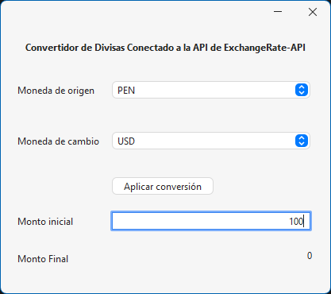
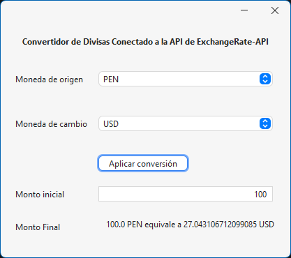

# convertidor
He desarrollado un convertidor de Divisas conectado a una API, en este caso he utilizado la API de exchangeRate que me permite 1500 consultas y me sirve bastante bien para hacer las conversiones de divisas, además agregue una libreria externa para darle un mejor diseño en el Jframe que es flatlaf de https://www.formdev.com/flatlaf/
Además agrego 2 imagenes a continuación para que se visualice de como quedo: 
Imagen antes de darle al boton ***Aplicar conversión***

Imagen después de darle al boton ***Aplicar conversión***

